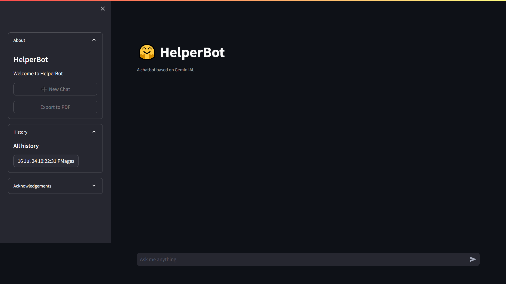

# HelperBot

Welcome to **HelperBot**, your interactive learning companion powered by **Gemini AI**.



<!-- Here is the link to the <a href="https://HelperBot.streamlit.app/" target="_blank">HelperBot</a> web application. -->

## Features

### 1. API Integration

Easily integrate with Gemini AI by obtaining your API key from Google AI and adding it to the `.env` file. This seamless
connection allows HelperBot to tap into the power of artificial intelligence, making your chatbot experience dynamic
and responsive.

### 2. Multiple Sessions

HelperBot supports the creation of **multiple chat sessions**. Whether you're discussing different topics, assisting
various users, or simply exploring, each session is distinct and adaptable. Keep track of your interactions
effortlessly.

### 3. Export to PDF

Need a record of your chat sessions? No problem! HelperBot provides a convenient **export functionality**. Capture your
conversations in PDF format for future reference, sharing, or archiving. It's like having a digital diary at your
fingertips.

## Installation Steps

Follow these steps to get started:

1. Generate your API key from <a href="https://ai.google.dev/" target="_blank">Google AI</a>
2. Clone this repository using `git clone https://github.com/shakya1527/HelperBot.git`
3. Create a `.env` file and add your API key.
4. Install the required packages with `pip install -r requirements.txt`.
5. Run the Streamlit app using `streamlit run .\src\project\__init__.py`.


## Acknowledgments

HelperBot owes its existence to the following components:

1. **Python**: The versatile programming language that forms the backbone of this project.
2. **Streamlit**: The user-friendly framework that transforms code into interactive web applications.
3. **Gemini AI**: The brilliant artificial intelligence engine that powers HelperBot's responses.
4. **Mdpdf**: The tool responsible for exporting chat sessions to PDF, ensuring your conversations are preserved.

## License

```
MIT License

Copyright (c) 2024 Shakya

Permission is hereby granted, free of charge, to any person obtaining a copy
of this software and associated documentation files (the "Software"), to deal
in the Software without restriction, including without limitation the rights
to use, copy, modify, merge, publish, distribute, sublicense, and/or sell
copies of the Software, and to permit persons to whom the Software is
furnished to do so, subject to the following conditions:

The above copyright notice and this permission notice shall be included in all
copies or substantial portions of the Software.

THE SOFTWARE IS PROVIDED "AS IS", WITHOUT WARRANTY OF ANY KIND, EXPRESS OR
IMPLIED, INCLUDING BUT NOT LIMITED TO THE WARRANTIES OF MERCHANTABILITY,
FITNESS FOR A PARTICULAR PURPOSE AND NONINFRINGEMENT. IN NO EVENT SHALL THE
AUTHORS OR COPYRIGHT HOLDERS BE LIABLE FOR ANY CLAIM, DAMAGES OR OTHER
LIABILITY, WHETHER IN AN ACTION OF CONTRACT, TORT OR OTHERWISE, ARISING FROM,
OUT OF OR IN CONNECTION WITH THE SOFTWARE OR THE USE OR OTHER DEALINGS IN THE
SOFTWARE.
```
